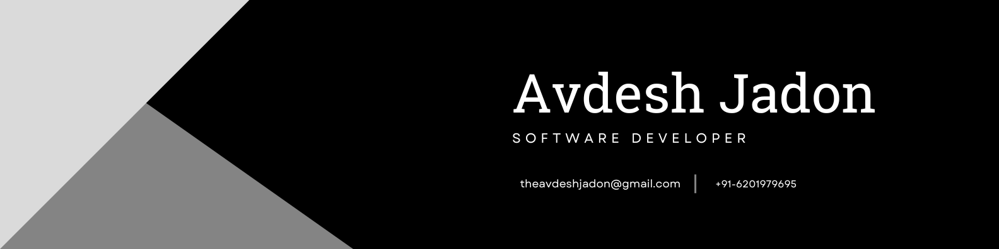

# Hello World!, I'm Avdesh Jadon, a Indian Software Developer 👋🏼:
🛜 currently working on my own [webpage](https://avdeshjadon-dev.github.io/MyPortfolio/) 👨🏼‍🎓 studying computer science at Lovely Professional University 👨🏼‍💻 working as a Software developer since 2024  🎬 just started out with my Passion  

# 💻 Tech Stack:
  
  
  

<picture>
  <source media="(prefers-color-scheme: dark)" srcset="https://raw.githubusercontent.com/tobiasmeyhoefer/tobiasmeyhoefer/output/github-snake-dark.svg" />
  <source media="(prefers-color-scheme: light)" srcset="https://raw.githubusercontent.com/tobiasmeyhoefer/tobiasmeyhoefer/output/github-snake.svg" />
  
</picture>
